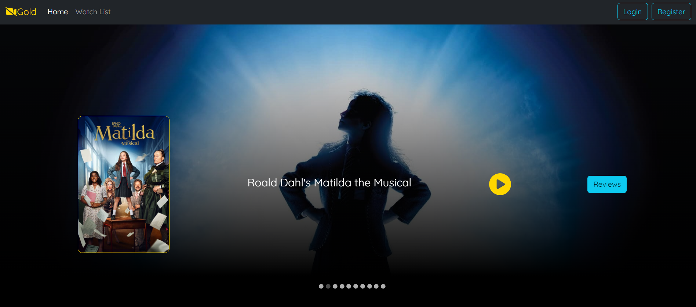

# CineCritique Hub - Client

CineCritique Hub is an online platform for movie enthusiasts to write and publish their reviews of movies. Additionally, users have access to a personal dashboard that helps them keep track of all their reviews, including details such as the movie title, the content of the review, and the date it was posted.

__Future Plans__
- User Authentication
- Favorite List
- Movie Recommendation

Home page

### Prerequisites

Please install/create the following if you have not already:

* Git
* Node.js
* MongoDB account
* Visual Studio Code

## Technologies Used

Frontend
* React
* JavaScript
* HTML/CSS
* Axios
* React-Router-Dom

## Acknowledgments

I used this course as a basis to develop CineCritique Hub.

* Full Stack Development with Java Spring Boot, React, and MongoDB – Full Course: https://www.youtube.com/watch?v=5PdEmeopJVQ.

